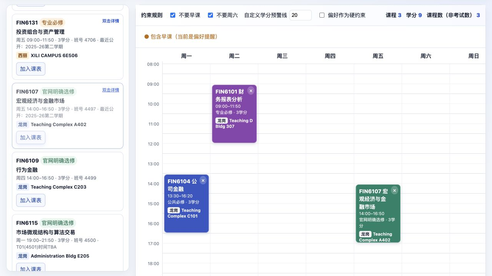
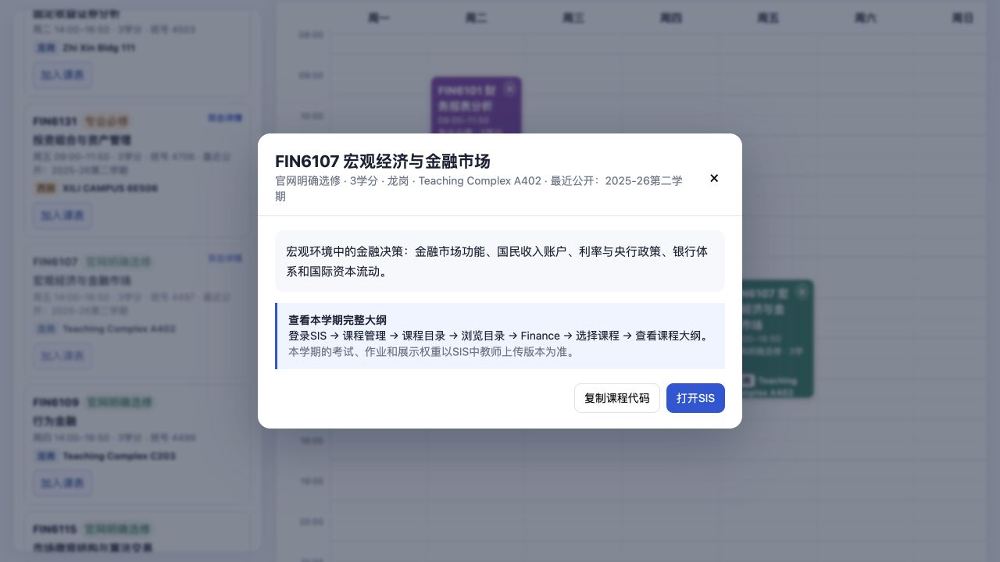
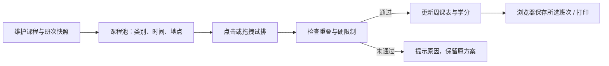

# 选课沙盘

一个从自己选课时的麻烦出发，做给同学一起用的小工具。把课程放进一张周课表，先试排、看冲突和地点，再去学校系统完成选课。



*临时选了三门课，共 9 学分。早课作为软偏好时，周二的课可以保留，页面会提醒。截图是演示方案，不是个人实际课表。*

## 为什么会做这个

做这个项目，是因为我自己选课时觉得很不方便。

在我使用的学校选课流程里，很难把所有想选的课放在一起，预览它们在一周里是什么样子。每看上一门课，都得再查一遍时间，和已经选的课对照，确认有没有冲突。上课地点还要另外考虑：时间排得开，不代表两节课之间一定来得及换校区。

访问也是一道门槛。我使用学校系统时需要校园网络环境，在校外往往要先连接学校 VPN，才能继续查看或调整选课。但很多时候，我还没有决定要改哪门课，只是想比较几个方案。

所以我想先把「规划」这一步单独拿出来。把一个专业的课程按必修、选修等类别整理好，在日历上直观看到时间和地点，让大家随时试排。当前版本从 CFI 的部分课程和班次做起，还没有覆盖完整课程目录。

每个人的计划也不一样。有人不想上早课，有人想留出周末，也有人愿意为了喜欢的课程调整作息。沙盘不替大家选出唯一的最优课表，而是把选择的结果摆出来，让人自己决定。

## 现在可以做什么

| 想解决的事 | 目前的做法 |
| --- | --- |
| 先看有哪些课 | 按必修、选修和归属待确认等类别查看课程池 |
| 看一周会排成什么样 | 点击或拖拽加入周课表，预览各班次的时间 |
| 换班时检查冲突 | 同一课程换班不重复计学分；新班次冲突时拒绝变更，保留原方案 |
| 把上课地点一起考虑 | 在课程卡片和课表上显示校区、教室；目前不计算通勤时间 |
| 按个人安排试排 | 早课、周六可以作为软提醒或加入/换班时的硬限制，也能设置学分预警线 |
| 留下自己的方案 | 所选班次保存在当前浏览器，可打印课表 |
| 初步了解课程内容 | 双击课程池中的课程，查看简介、资料日期和本学期大纲查询入口 |



*课程介绍可以帮助判断兴趣，但历史介绍不能代替本学期的考核安排。详情页保留资料日期，并给出进一步查询的路径。*

## 为什么没有直接连上学校系统

目前还不能做到「在沙盘里选好，就已经正式选上」。这里的操作只改变本地方案，最终仍需要回到学校系统提交。

直接对接不只是多写一段脚本。校园内网访问、账号权限、选课数据和正式提交都需要分别处理；目前没有接入学校提供的正式选课接口，也不收集同学的账号密码。

工具自动化还受工具本身的访问和写入权限约束。与其把正式选课建立在一套尚未明确授权的自动点击流程上，我选择先把不依赖登录的规划做好。以后若有正式授权的接口，再讨论同步与提交。

因此，沙盘可以降低反复登录系统比较方案的成本，但不能绕过内网要求，也不能替代正式选课。

## 怎么实现的

当前是一个不需要构建的静态网页：HTML 负责页面结构，CSS 负责课程卡片和周课表，原生 JavaScript 处理选课、校验与渲染。课程、班次、地点和简介暂时直接维护在 `index.html` 中，没有后端和账号系统。



地点按班次关联，而不是只按课程代码关联，因为同一门课的不同班可能不在同一个地方。换班时先检查候选方案，再替换旧选择，避免失败后把原来的班也删掉。

`localStorage` 保存所选班次，不需要注册。偏好开关目前不会随之保存；也不能自动跨设备同步，清理浏览器数据会丢失方案。更多实现细节见 [设计记录](docs/decisions.md)。

## 接下来想改什么

我最想补的不是更多按钮，而是选课时真正缺少的信息：这门课具体学什么、如何考核，以及学过的人怎么看。

这里的「考核构成」指期中、期末、作业、展示等各占多少分，和往届学生最终成绩的分布是两回事。前者适合整理自当期大纲；当前项目没有后者的数据。

下面是迭代顺序，不是已经排定日期的交付承诺。前两步会优先考虑，课程评价仍是后续设想。

| 阶段 | 想做的改进 | 到什么程度才算完成 |
| --- | --- | --- |
| 已实现：先把课排出来 | 分类课程池、周视图、冲突检查、地点展示和本地保存 | 能用已收录班次试排方案，失败的换班不破坏原选择 |
| 下一步：把课程说清楚 | 补充课程目标、主要内容、先修要求，以及当期考核构成 | 每条信息标明学期、来源和核对日期；缺失项明确留空 |
| 随后：让数据能持续更新 | 将课程数据与页面分开，增加版本和变更记录，支持经核验的数据更新 | 时间、地点或大纲变化后，能重新检查已有方案；在 Add/Drop 周仍然有用 |
| 后续考虑：加入选课经验 | 收集学长学姐自愿分享的简短评价，例如工作量、授课方式和适合的基础 | 注明对应学期，区分个人体验与课程事实；公开前取得分享者同意并去掉个人信息 |
| 继续完善排课规则 | 处理具体上课周次、日期区间和跨校区通勤间隔 | 不同周次不误报重叠，也不把时间相邻但无法赶到的安排当成可行 |

动态更新目前还没有实现。它也不一定意味着直接抓取内网：可以先从维护者核验后发布数据版本做起；更新来源和授权条件明确后，再考虑自动化。

## 为什么愿意分享出来

这个工具最初解决的是我自己的问题。但既然能借助工具把它做出来，我也愿意免费分享给同班同学，让大家少做一点重复检查。

我不太把这件事看成零和竞争。掌握一点技术，不一定要把它留成只有自己能用的优势。一个人能做出来的东西，如果也能帮到身边的人，我觉得就值得把它整理好、开放出来。

对我来说，这也是这个项目很重要的一部分：不只完成一个自己能用的页面，还愿意说明它怎么用、哪里还不可靠，让别人也能放心地判断要不要使用。

## 本地打开与检查

直接打开 `index.html`，或者在仓库目录运行：

```sh
python3 -m http.server 8080
```

访问 `http://localhost:8080`。规则检查：

```sh
node check-planner.cjs
```

当前附带的是 **2026-08-27 的部分课程与班次快照**，不是实时余量。选课资格、培养方案归属、考试安排和报名结果仍以学校当期信息为准；TBA、指定周和跨学期课程也需要额外核对。

项目使用 Codex 辅助开发与整理。代码使用 MIT License；课程资料权利归原提供方。
